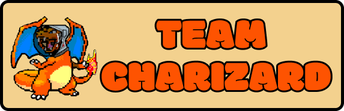
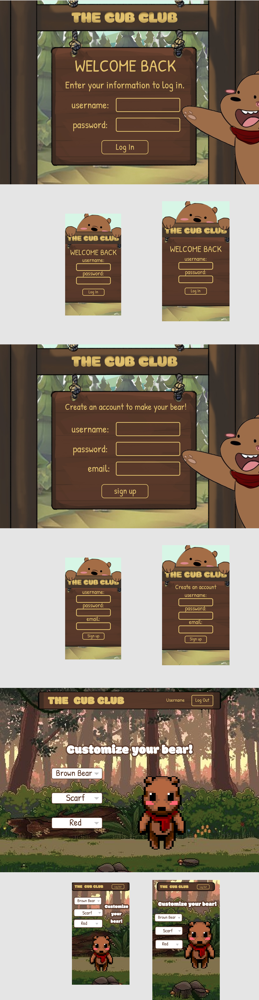
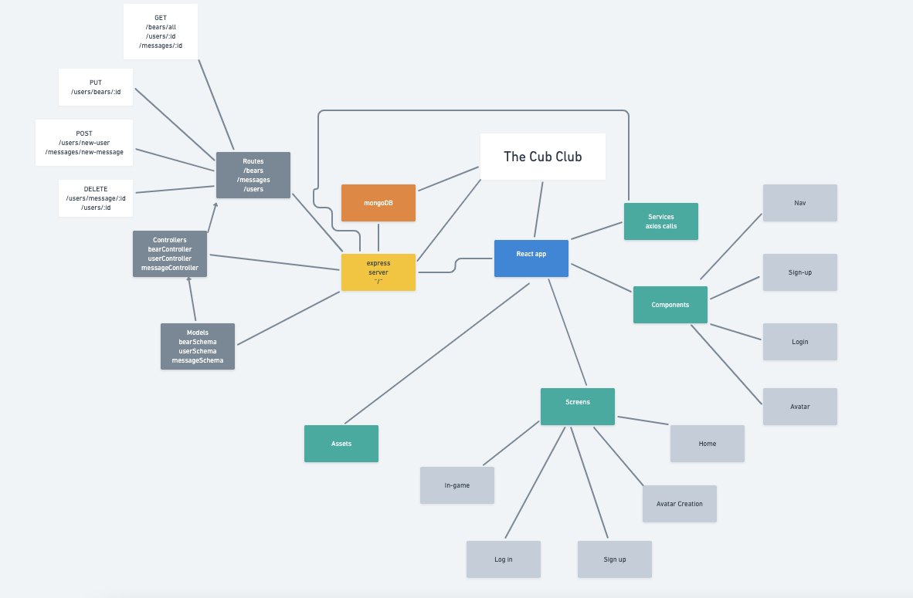

# Project Three



## Members
- Nate Shim
- Rachel Perez
- Ben Lowry(lead)

## Group Expectations
[Expectations](https://docs.google.com/document/d/17vjiRVQr10uu08LhCUjf3K4EKkcDMfGjmgY4BHxeJo8/edit)

## Project Name and Description
### Project Name
The Cub Club


## Project Description

The Cub CLub is a Social MMO/Virtual World where players can interact, message and play with eachother as custom bear avatars. 

### Project Description
The Cub CLub is a Social MMO/Virtual World where players can interact, message and play with each other as a custom 8bit bear.


The object of the game is social interaction.

"I as a User would like to talk to other people around the world as a cute Bear".


## API and Data Sample
```json
/users/all
{
    "_id": "616471b0a7e9a258d095cce8",
    "username": "beeboop12",
    "email": "beeb@email.com",
    "bear": {
      "_id": "6164709b5c410e950476c741",
      "color": "panda",
      "__v": 0,
      "createdAt": "2021-10-11T17:12:59.845Z",
      "updatedAt": "2021-10-11T17:12:59.845Z"
    }
```
```json
/bears/all

{
    "_id": "6164709b5c410e950476c73e",
    "color": "black",
    "__v": 0,
    "createdAt": "2021-10-11T17:12:59.844Z",
    "updatedAt": "2021-10-11T17:12:59.844Z"
  },
  {
    "_id": "6164709b5c410e950476c73f",
    "color": "brown",
    "__v": 0,
    "createdAt": "2021-10-11T17:12:59.844Z",
    "updatedAt": "2021-10-11T17:12:59.844Z"
  },
  {
    "_id": "6164709b5c410e950476c740",
    "color": "white",
    "__v": 0,
    "createdAt": "2021-10-11T17:12:59.845Z",
    "updatedAt": "2021-10-11T17:12:59.845Z"
  },
  {
    "_id": "6164709b5c410e950476c741",
    "color": "panda",
    "__v": 0,
    "createdAt": "2021-10-11T17:12:59.845Z",
    "updatedAt": "2021-10-11T17:12:59.845Z"
  }
  ```

  ```json
  /letters/all
   {
    "_id": "6164b6a8bb8f0281c42f1c42",
    "title": "esse tenetur voluptate dolores est et",
    "recipient": {
      "_id": "616471b0a7e9a258d095ccea",
      "username": "herrderr543",
      "email": "heer543@email.com",
      "bear": "6164709b5c410e950476c741",
      "__v": 0,
      "createdAt": "2021-10-11T17:17:36.127Z",
      "updatedAt": "2021-10-11T17:17:36.127Z"
    },
    "letter": "Fuga atque corporis labore. At cum maiores et. Quia qui explicabo nam aut dolor magnam libero. Voluptatum sit et quibusdam qui est velit ipsa numquam laborum. Consequuntur nesciunt non et ad consectetur minima. Dolor maxime voluptas ut.",
    "sender": {
      "_id": "616471b0a7e9a258d095cce8",
      "username": "beeboop12",
      "email": "beeb@email.com",
      "bear": "6164709b5c410e950476c741",
      "__v": 0,
      "createdAt": "2021-10-11T17:17:36.126Z",
      "updatedAt": "2021-10-11T17:17:36.126Z"
    },
    "__v": 0,
    "createdAt": "2021-10-11T22:11:52.410Z",
    "updatedAt": "2021-10-11T22:11:52.410Z"
  }
  ```

## MVP Goals
- User AUTH
- User can login and make a bear avatar
- User can load into game room
- User can interact with mailbox to send letter to other players

## Post-MVP Goals
- Websockets
- Animation
- Music
- A secondary room instance
- Mini games

## Database Schemas
_Please provide a sample of how you intend to build your models. A Schema object for each of your models is ideal._

```
bearSchema
const { model, Schema } = require("mongoose");


// Create a bear

const bearSchema = new Schema(
    {
        
        color: {type: String, required: true},

    },
    {timestamps: true}
)

module.exports = model("Bear", bearSchema);
```
```
letterSchema 
const { model, Schema } = require("mongoose");

// letters
const letterSchema = new Schema(
  {
    title: { type: String, required: true },
    recipient: { type: Schema.Types.ObjectId, ref: "User", required: true },
    letter: { type: String, require: true },
    sender: { type: Schema.Types.ObjectId, ref: "User", required: true }
  },
  { timestamps: true }
);

module.exports = model("letter", letterSchema);

```
```
userSchema
const { model, Schema } = require("mongoose");


// User
const userSchema = new Schema({
    username: { type: String, required: true, unique: true},
    email: { type: String, required: true},
    //password Auth
    bear: { type: Schema.Types.ObjectId, ref: "Bear", required: true  }
},
{timestamps: true});


module.exports = model("User", userSchema);
```

## Whimsical
_Please post your application's full stack diagram here as an IMAGE, not as a link._

## Wireframes
_For each screen you intend on showing, provide a wireframe for both desktop and mobile._


#### Home


#### In-game + Mail Modal


#### Forms


#### App Hierarchy


 

## Timeframes
_Use the table below to create your team's timeframes. Given the project is about a week long, you can add between 40 hours * group members (i.e. 120 hours for 3 group members)._

| component                   | Priority | Estiamted Time | Time Invested | Actual Time |
| --------------------------- | -------- | -------------- | ------------- | ----------- |
| Backend basics              | H        | 3              | 3             | 3           |
| Wireframes                  | H        | 3              | 3             | 3           |
| Visual Dev                  | H        | 3              | 3             | 3           |
| Flowchart                   | H        | 3              | 3             | 3           |
| Expectations                | H        | 1              | 1             | 1           |
| Readme                      | H        | 3              | 3             | 3           |
| CSS                         | M        | 9              |               |             |
| Mongo                       | H        | 3              |               |             |
| Walk Animations             | L        | 9              |               |             |
| User Auth                   | H        | 5              |               |             |
| Research                    | H        | 9              | 9             | 9           |
| Style Homepage              | H        | 3              |               |             |
| Art Assets                  | H        | 3              |               |             |
| Frame and Enviroment Assets | H        | 3              |               |             |
| Component: Nav              | H        | 3              |               |             |
| Component: Singup           | H        | 3              |               |             |
| Component: Login            | H        | 3              |               |             |
| Component: Avatar           | H        | 3              |               |             |
| Screen: Home                | M        | 2              |               |             |
| Screen: Avatar Creation     | M        | 3              |               |             |
| Screen: In-Game             | M        | 3              |               |             |
| Screen: Sign up             | M        | 2              |               |             |
| Screen: Login               | M        | 2              |               |             |
| Mongo: DB                   | H        | 2              |               |             |
| Mongoose: Models            | H        | 2              |               |             |
| Mongoose: Seeds             | H        | 2              |               |             |
| Express: Routes             | H        | 9              |               |             |
| Express: Controllers        | H        | 9              |               |             |
| Express: Server             | H        | 9              |               |             |
| React: Services/Axios calls | H        | 3              |               |             |
|                             |          | 120            | 25            | 25          |


## SWOT Analysis

## Nate
### Strengths:
- I think I am good at knowing what needs to do done overall for a feature to work and then splitting it up into smaller steps 

### Weaknesses:
- Overthinking and trying to implement a more complicated version in one go rather than first implement a solid basic version.

### Opportunities:
- Managing tasks will help me code in a team environment better

### Threats:
- Regularly committing, updating trello

## Rachel
### Strengths:
- Art assets/vision/ux design
### Weaknesses:
- Time management (in relation to CSS/Art assets)
### Opportunities:
- I want to learn as much as I can about web sockets and game mechanics as possible!
### Threats:
- Combining work from three persons without merge issues


## Ben
### Strengths:
- I have a pretty good handle on the backend 

### Weaknesses:
- Staying on track and not going down rabbit holes 

### Opportunities:
- Managing tasks will help me code in a team environment better

### Threats:
- Keeping the README and kanban board up to date
- Managing my OWN time

### Citations
