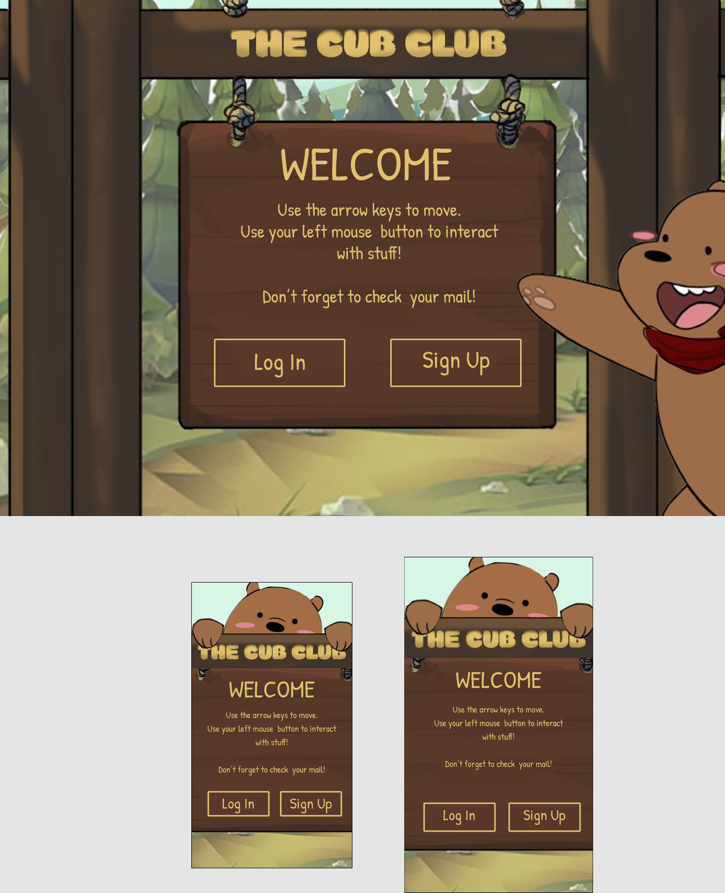
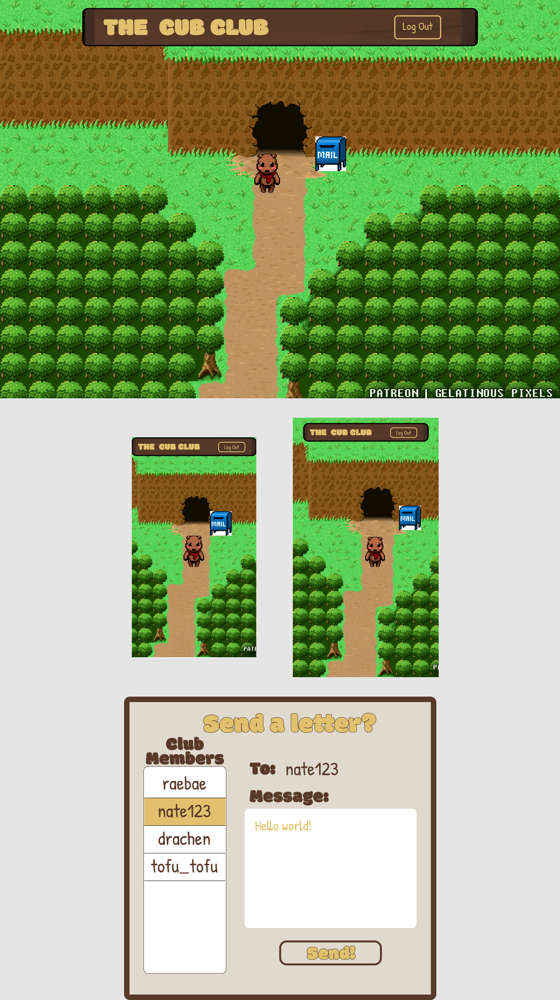

# Project Three

## Members
- Nate Shim
- Rachel Perez
- Ben Lowry(lead)

## Group Expectations
[Expectations](https://docs.google.com/document/d/17vjiRVQr10uu08LhCUjf3K4EKkcDMfGjmgY4BHxeJo8/edit)

## Project Name and Description
### Project Name
The Cub Club


## Project Description

The Cub CLub is a Social MMO/Virtual World where players can interact, message and play with eachother as custom bear avatars. 

### Project Description
The Cub CLub is a Social MMO/Virtual World where players can interact, message and play with each other as a custom 8bit bear.


The object of the game is social interaction.

"I as a User would like to talk to other people around the world as a cute Bear".


## API and Data Sample

## MVP Goals
- User AUTH
- User can login and make a bear avatar
- User can load into game room
- User can interact with mailbox to send messages to other players

## Post-MVP Goals
- Websockets
- Animation
- Music
- A secondary room instance
- Mini games

## Database Schemas
_Please provide a sample of how you intend to build your models. A Schema object for each of your models is ideal._

```json
/users/all
{
    "_id": "616471b0a7e9a258d095cce8",
    "username": "beeboop12",
    "email": "beeb@email.com",
    "bear": {
      "_id": "6164709b5c410e950476c741",
      "color": "panda",
      "__v": 0,
      "createdAt": "2021-10-11T17:12:59.845Z",
      "updatedAt": "2021-10-11T17:12:59.845Z"
    }
```
```json
/bears/all

{
    "_id": "6164709b5c410e950476c73e",
    "color": "black",
    "__v": 0,
    "createdAt": "2021-10-11T17:12:59.844Z",
    "updatedAt": "2021-10-11T17:12:59.844Z"
  },
  {
    "_id": "6164709b5c410e950476c73f",
    "color": "brown",
    "__v": 0,
    "createdAt": "2021-10-11T17:12:59.844Z",
    "updatedAt": "2021-10-11T17:12:59.844Z"
  },
  {
    "_id": "6164709b5c410e950476c740",
    "color": "white",
    "__v": 0,
    "createdAt": "2021-10-11T17:12:59.845Z",
    "updatedAt": "2021-10-11T17:12:59.845Z"
  },
  {
    "_id": "6164709b5c410e950476c741",
    "color": "panda",
    "__v": 0,
    "createdAt": "2021-10-11T17:12:59.845Z",
    "updatedAt": "2021-10-11T17:12:59.845Z"
  }
  ```

  ```json
  /messages/all
   {
    "_id": "616479575c93675128ec084f",
    "title": "nemo sint assumenda et incidunt earum",
    "author": {
      "_id": "616471b0a7e9a258d095cce8",
      "username": "beeboop12",
      "email": "beeb@email.com",
      "bear": "6164709b5c410e950476c741",
      "__v": 0,
      "createdAt": "2021-10-11T17:17:36.126Z",
      "updatedAt": "2021-10-11T17:17:36.126Z"
    }
  ```


## Whimsical
_Please post your application's full stack diagram here as an IMAGE, not as a link._

## Wireframes
_For each screen you intend on showing, provide a wireframe for both desktop and mobile._


#### Home


#### In-game


#### App Hierarchy

## Timeframes
_Use the table below to create your team's timeframes. Given the project is about a week long, you can add between 40 hours * group members (i.e. 120 hours for 3 group members)._

| Component | Priority | Estimated Time | Time Invested | Actual Time |
| --- | :---: |  :---: | :---: | :---: |
| Adding Form | H | 3hrs| 3.5hrs | 3.5hrs |
| Working with API | H | 3hrs| 2.5hrs | 2.5hrs |
| Total | H | 6hrs| 5hrs | 5hrs |


## SWOT Analysis

## Nate
### Strengths:

### Weaknesses:

### Opportunities:

### Threats:

## Rachel
### Strengths:


### Weaknesses:

### Opportunities:

### Threats:


## Ben
### Strengths:
- I have a pretty good handle on the backend 


### Weaknesses:
- Staying on track and not going down rabbit holes 

### Opportunities:
- Managing tasks will help me code in a team environment better

### Threats:
- Keeping the README and kanban board up to date
- Managing my OWN time

### Citations
